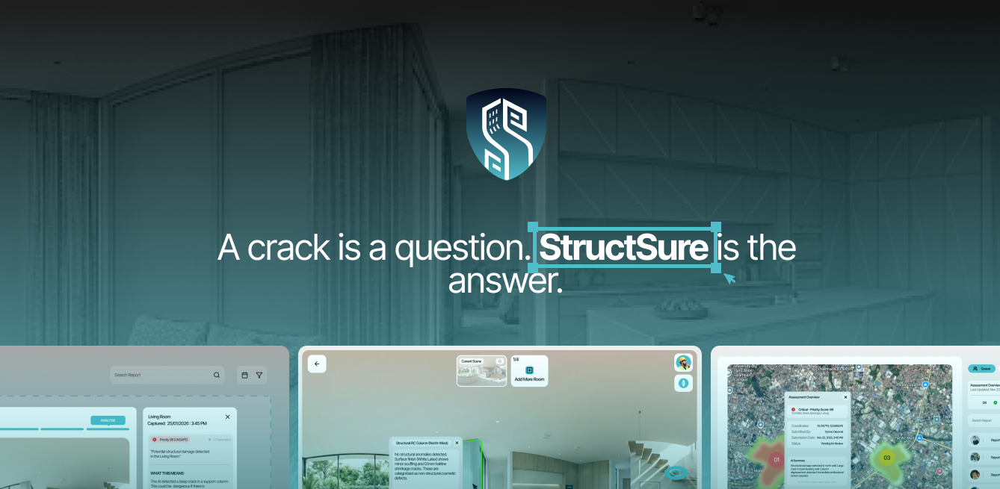

  

# SaferEarth 🏗️

**Your Building's Health Monitor - Track structural safety every day, not just after disasters**

---

## 🎯 What We Do

StructSure is an AI-powered platform that helps homeowners, property managers, and investors continuously monitor their buildings' structural health. Using smartphone photos and cutting-edge computer vision, we detect changes over time, alert you to growing problems, and connect you with engineers when needed.

**Making structural safety accessible and affordable for everyone.**

## ✨ Key Features

🏠 **Everyday Monitoring** - Create digital twins, detect cracks, track deterioration over time  
🔍 **AI Change Detection** - Compare photos to spot new damage and growth patterns  
⚠️ **Smart Risk Scoring** - Green (cosmetic) → Yellow (monitor) → Red (engineer needed)  
👨‍🔬 **Engineer On-Demand** - Licensed professionals review critical cases remotely  
📊 **Portfolio Management** - Monitor multiple buildings from one dashboard  
🌍 **Disaster Response** - Instantly compare before/after earthquake damage

## 🤖 Technology Stack

- **AI Pipeline**: Grounding DINO + SAM 2 → Gemini 2.5 Pro
- **Zero-Shot Learning**: Works on any building, any age, no retraining
- **Standards-Based**: ATC-20 & EMS-98 protocols
- **Cloud-Native**: Scalable, cost-efficient architecture

## 💡 Why StructSure?

✅ **97% cheaper** than traditional in-person inspections  
✅ **Continuous monitoring** vs. one-time assessments  
✅ **Early detection** prevents costly repairs  
✅ **Insurance-ready** digital documentation

---

  <strong>Building a safer future, one structure at a time.</strong>

